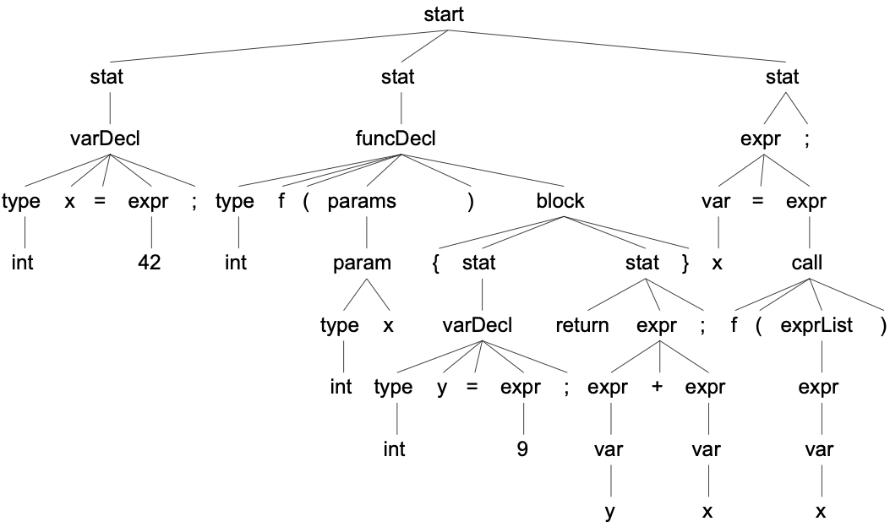
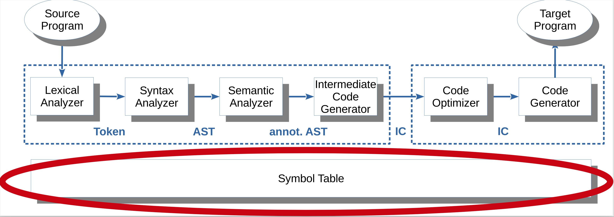

## Was passiert nach der Syntaxanalyse?

:::::: columns
::: {.column width="30%"}

\vspace{2mm}

``` {.c size="footnotesize"}
int x = 42;
int f(int x) {
    int y = 9;
    return y+x;
}

x = f(x);
```

:::
::: {.column width="70%"}

{width="80%"}

:::
::::::

::::::::: notes
Nach der Syntaxanalyse braucht der Compiler für die  darauf folgenden Phasen
**semantische Analyse**, Optimierung und Codegenerierung **Informationen
über Bezeichner**, z.B.

*   Welcher Bezeichner ist gemeint?
*   Welchen Typ hat ein Bezeichner?

Auf dem Weg zum Interpreter/Compiler müssen die Symbole im AST korrekt zugeordnet
werden. Dies geschieht über Symboltabellen. Im Folgenden werden wir verschiedene
Aspekte von Symboltabellen betrachten und eine mögliche Implementierung erarbeiten,
bevor wir uns (in [Interpreter](../06-interpretation/syntaxdriven.md))
um die Auswertung (Interpretation) des AST kümmern können.

### Logische Compilierungsphasen

*   Die lexikalische Analyse generiert eine Folge von Token.
*   Die Syntaxanalyse generiert einen Parse Tree.

\smallskip

*   Die semantische Analyse macht folgendes:
    *   Der Parse Tree wird in einen abstrakten Syntaxbaum (AST) umgewandelt.
    *   Dieser wird häufig mit Attributen annotiert.
    *   Dabei sind oft mehrere Baumdurchläufe nötig (z.B. wegen der Abhängigkeiten
        der Attribute).

\smallskip

*   Nachfolgende Stufen:
    *   Der AST wird in einen Zwischencode umgewandelt mit Registern und virtuellen
        Adressen.
    *   Der Zwischencode wird optimiert.
    *   Aus dem optimierten Zwischencode wird der endgültige Code, aber immer noch
        mit virtuellen Adressen, generiert.
    *   Der generierte Code wird nachoptimiert.
    *   Der Linker ersetzt die virtuellen Adressen durch reale Adressen.

### Abgrenzung der Phasen

Diese Phasen sind oft nicht klar unterscheidbar. Schon allein zur Verbesserung der
Laufzeit baut der Parser oft schon den abstrakten Syntaxbaum auf, der Lexer trägt schon
Bezeichner in Symboltabellen ein, der Parser berechnet beim Baumaufbau schon Attribute,
...

Oft werden gar nicht alle Phasen und alle Zwischendarstellungen benötigt.
:::::::::


## Semantische Analyse und Symboltabellen

{width="80%"}


## Syntax und Semantik

*   **Syntaxregeln**: Formaler Aufbau eines Programms

\smallskip

*   **Semantik**: Bedeutung eines (syntaktisch korrekten) Programms

\bigskip
\bigskip

=> Keine Codegenerierung für syntaktisch/semantisch inkorrekte Programme!

::: notes
Zur Erinnerung: Die *Syntaxregeln* einer Programmiersprache bestimmen den formalen
Aufbau eines zu übersetzenden Programms. Die *Semantik* gibt die Bedeutung eines
syntaktisch richtigen Programms an.

Lexikalische und syntaktische Analyse können formalisiert mit regulären Ausdrücken und
endlichen Automaten, sowie mit CFG und Parsern durchgeführt werden.

Die Durchführung der semantischen Analyse ist stark von den Eigenschaften der zu
übersetzenden Sprache, sowie der Zielsprache abhängig und kann hier nur beispielhaft
für einige Eigenschaften erklärt werden.

Es darf kein lauffähiges Programm erstellt werden können, dass nicht syntaktisch und
semantisch korrekt ist. Ein lauffähiges Programm muss syntaktisch und semantisch korrekt
sein!
:::

## Aufgaben der semantischen Analyse

*   Identifikation und Sammlung der Bezeichner
*   Zuordnung zur richtigen Ebene (Scopes)

\smallskip

*   Typ-Inferenz
*   Typkonsistenz (Ausdrücke, Funktionsaufrufe, ...)

\smallskip

*   Validieren der Nutzung von Symbolen
    -   Vermeidung von Mehrfachdefinition
    -   Zugriff auf nicht definierte Bezeichner
    -   (Lesender) Zugriff auf nicht initialisierte Bezeichner
    -   Funktionen werden nicht als Variablen genutzt
    -   ...

::: notes
Die semantische Analyse überprüft die Gültigkeit eines syntaktisch korrekten Programms
bzgl. statischer semantischer Eigenschaften und liefert die Grundlage für die (Zwischen-)
Codeerzeugung und -optimierung. Insbesondere wird hier die Typkonsistenz (in Ausdrücken,
von Parametern, ...) überprüft, und  implizite Typumwandlungen werden vorgenommen. Oft
müssen Typen automatisch bestimmt werden (z.B. bei Polymorphie, Typinferenz). Damit
Typen bestimmt oder angepasst werden können, müssen Bezeichner zunächst identifiziert
werden, d.h. bei namensgleichen Bezeichnern der richtige Bezug bestimmt werden.

Zu Annotationen/Attributen, Typen und Type-Checks siehe VL
[Typprüfungen, Attributgrammatiken](attribgrammars.md)
:::

\bigskip
\bigskip

=> [Ein wichtiges]{.notes} Hilfsmittel dazu sind **Symboltabellen**

::: notes
### Identifizierung von Objekten

Beim Compiliervorgang müssen Namen immer wieder den dazugehörigen Definitionen
zugeordnet, ihre Eigenschaften gesammelt und geprüft und darauf zugegriffen werden.
Symboltabellen werden im Compiler fast überall gebraucht (siehe Abbildung unter
"Einordnung").

Welche Informationen zu einem Bezeichner gespeichert und ermittelt werden, ist dann
abhängig von der Klasse des Bezeichners.
:::

::: notes
### Validieren der Nutzung von Symbolen

Hier sind unendlich viele Möglichkeiten denkbar. Dies reicht von den unten aufgeführten
Basisprüfungen bis hin zum Prüfen der Typkompatibilität bei arithmetischen Operationen.
Dabei müssen für alle Ausdrücke die Ergebnistypen berechnet werden und ggf. automatische
Konvertierungen vorgenommen werden, etwa bei `3+4.1` ...

*   Zugriff auf Variablen: Müssen sichtbar sein
*   Zugriff auf Funktionen: Vorwärtsreferenzen sind OK
*   Variablen werden nicht als Funktionen genutzt
*   Funktionen werden nicht als Variablen genutzt

=> Verweis auf VL [Typprüfungen, Attributgrammatiken](attribgrammars.md)

Da Funktionen bereits vor dem Bekanntmachen der Definition aufgerufen werden dürfen, bietet
sich ein **zweimaliger Durchlauf** (*pass*) an: Beim ersten Traversieren des AST werden alle
Definitionen in der Symboltabelle gesammelt. Beim zweiten Durchlauf werden dann die Referenzen
aufgelöst.
:::

::: notes
### Das Mittel der Wahl: Tabellen für die Symbole (= Bezeichner)

**Def.:** *Symboltabellen* sind die zentrale Datenstruktur zur Identifizierung und
Verwaltung von bezeichneten Elementen.

Die Organisation der Symboltabellen ist stark anwendungsabhängig. Je nach Sprachkonzept
gibt es eine oder mehrere Symboltabellen, deren Einträge vom Lexer oder Parser angelegt
werden. Die jeweiligen Inhalte jedes einzelnen Eintrags kommen aus den verschiedenen
Phasen der Compilierung. Symboltabellen werden oft als Hashtables oder auch als Bäume
implementiert, manchmal als verkettete Listen. In seltenen Fällen kommt man auch mit
einem Stack aus.

Eine Symboltabelle enthält benutzerdefinierte Bezeichner (oder Verweise in eine Hashtable
mit allen vorkommenden Namen), manchmal auch die Schlüsselwörter der Programmiersprache.
Die einzelnen Felder eines Eintrags variieren stark, abhängig vom Typ des Bezeichners
(= Bezeichnerklasse).

Manchmal gibt es für Datentypen eine Extra-Tabelle, ebenso eine für die Werte von Konstanten.

Manchmal werden die Namen selbst in eine (Hash-) Tabelle geschrieben. Die Symboltabelle
enthält dann statt der Namen Verweise in diese (Hash-) Tabelle.
:::


## Einfache Verwaltung von Variablen primitiven Typs

:::::: columns
::: {.column width="40%"}
\vspace{4mm}
```c
int x = 0;
int i = 0;

for (i=0; i<10; i++) {
    x++;
}
```
:::
::: {.column width="20%"}
::: slides
{width="80%"}
:::
::: notes
{width="20%"}
:::
:::
::::::

::: notes
**Bsp.:** Die zu übersetzende Sprache hat nur einen (den globalen) Scope und kennt nur
Bezeichner für Variablen.

*   **Eine** Symboltabelle für **alle** Bezeichner
*   Jeder Bezeichner ist der Name einer Variablen
*   Symboltabelle wird evtl. mit Einträgen aller Schlüsselwörter initialisiert  --  warum?
*   Scanner erkennt Bezeichner und sucht ihn in der Symboltabelle
*   Ist der Bezeichner nicht vorhanden, wird ein (bis auf den Namen leerer) Eintrag angelegt
*   Scanner übergibt dem Parser das erkannte Token und einen Verweis auf den
    Symboltabelleneintrag

Die Symboltabelle könnte hier eine (Hash-) Tabelle oder eine einfache verkettete Liste sein.
:::


## Was kann jetzt weiter passieren?

```c
int x = 0;
int i = 0;

for (i=0; i<10; i++) {
    x++;
}

a = 42;
```

::: notes
In vielen Sprachen muss überprüft werden, ob es ein definierendes Vorkommen des Bezeichners oder
ein angewandtes Vorkommen ist.

### Definitionen und Deklarationen von Bezeichnern

**Def.:** Die *Definition* eines (bisher nicht existenten) Bezeichners in einem Programm
generiert einen neuen Bezeichner und legt für ihn seinem Typ entsprechend Speicherplatz an.

**Def.:** Unter der *Deklaration* eines (bereits existierenden) Bezeichners verstehen wir
seine Bekanntmachung, damit er benutzt werden kann. Er ist oft in einem anderen Scope
definiert und bekommt dort Speicherplatz zugeteilt.

Insbesondere werden auch Typen deklariert. Hier gibt es in der Regel gar keine
Speicherplatzzuweisung.

Ein Bezeichner kann beliebig oft deklariert werden, während er in einem Programm nur einmal
definiert werden kann. Oft wird bei der Deklarationen eines Elements sein Namensraum mit
angegeben.

**Vorsicht**: Die Begriffe werden auch anders verwendet. Z.B. findet sich in der
Java-Literatur der Begriff *Deklaration* anstelle von *Definition*.

**Anmerkung**:
Deklarationen beziehen sich auf Definitionen, die woanders in einer Symboltabelle stehen, evtl.
in einer anderen Datei, also in diesem Compilerlauf nicht zugänglich sind und erst von Linker
aufgelöst werden können. Beim Auftreten einer Deklaration muss die dazugehörige Definition gesucht
werden,und wenn vorhanden, im Symboltabelleneintrag für den deklarierten Bezeichner festgehalten
werden. Hier ist evtl. ein zweiter Baumdurchlauf nötig, um alle offenen Deklarationen, die sich
auf Definitionen in derselben Datei beziehen, aufzulösen.

Wird bei objektorientierten Sprachen ein Objekt definiert, dessen Klassendefinition in einer anderen
Datei liegt, kann man die Definition des Objekts gleichzeitig als Deklaration der Klasse auffassen
(Java).
:::

[[Definition vs. Deklaration]{.bsp}]{.slides}


## Wo werden Verweise in Symboltabellen gebraucht?

=> Parse Tree und AST enthalten Verweise auf Symboltabelleneinträge

::: notes
*   Im Parse Tree enthält der Knoten für einen Bezeichner einen Verweis auf den
    Symboltabelleneintrag.
*   Parser und semantische Analyse (AST) vervollständigen die Einträge.
*   Attribute des AST können Feldern der Symboltabelle entsprechen, bzw. sich aus
    ihnen berechnen.
*   Für Debugging-Zwecke können die Symboltabellen die ganze Compilierung und das
    Linken überleben.
:::


## Grenzen der semantischen Analyse

**Welche semantischen Eigenschaften [einer Sprache]{.notes} kann die semantische Analyse nicht überprüfen?**

\bigskip

*   Wer ist dann dafür verantwortlich?
*   Wie äußert sich das im Fehlerfall?

::: notes
Dinge, die erst durch eine Ausführung/Interpretation eines Programms berechnet werden können.

Beispielsweise können Werte von Ausdrücken oft erst zur Laufzeit bestimmt werden. Insbesondere
kann die semantische Analyse in der Regel nicht feststellen, ob ein Null-Pointer übergeben wird
und anschließend dereferenziert wird.
:::


## Wrap-Up

*   Semantische Analyse:
    *   Identifikation und Sammlung der Bezeichner
    *   Zuordnung zur richtigen Ebene (Scopes)
    *   Validieren der Nutzung von Symbolen
    *   Typ-Inferenz
    *   Typkonsistenz (Ausdrücke, Funktionsaufrufe, ...)

\smallskip

*   Symboltabellen: Verwaltung von Symbolen und Typen (Informationen über Bezeichner)
*   Symboltabelleneinträge werden an verschiedenen Stellen des Compilers generiert und benutzt


<!-- DO NOT REMOVE - THIS IS A LAST SLIDE TO INDICATE THE LICENSE AND POSSIBLE EXCEPTIONS (IMAGES, ...). -->
::: slides
## LICENSE


Unless otherwise noted, this work is licensed under CC BY-SA 4.0.
:::
